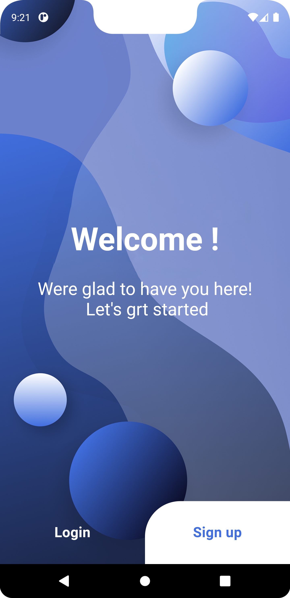
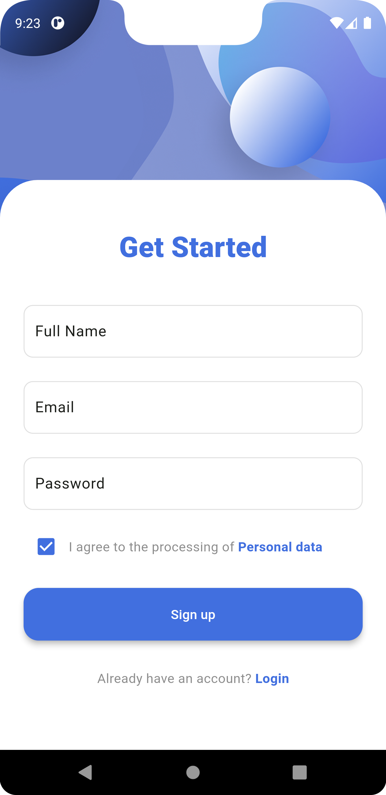
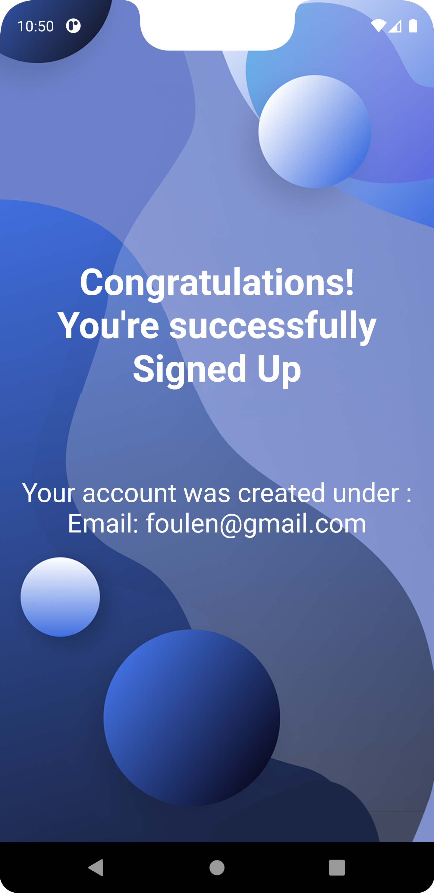
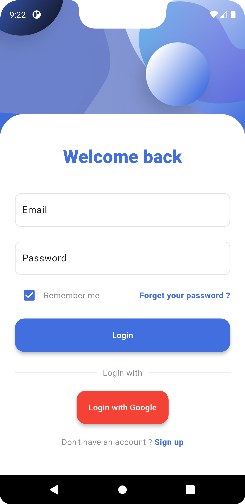
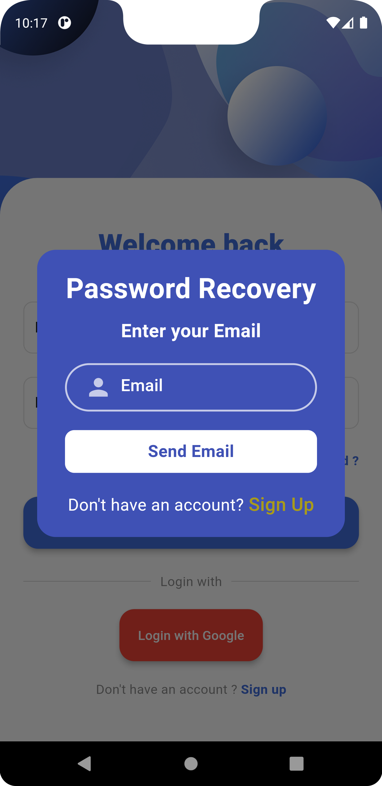
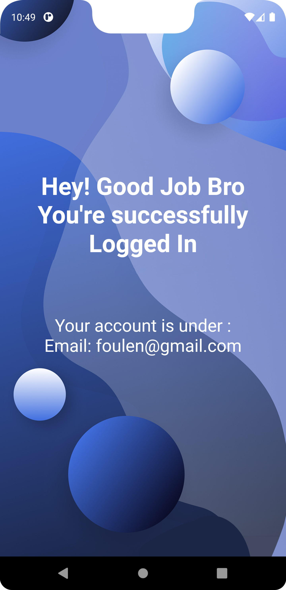
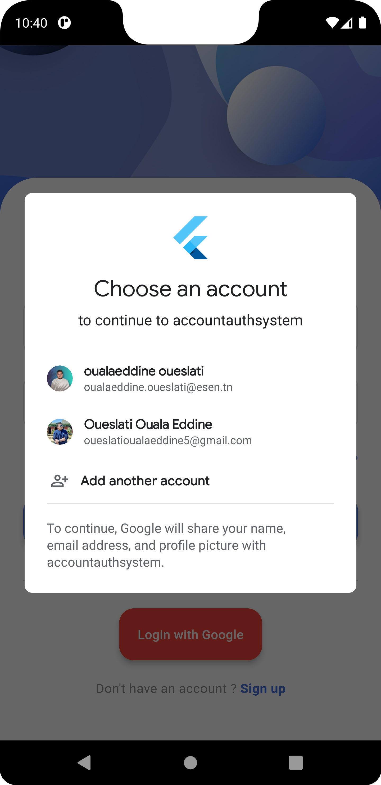
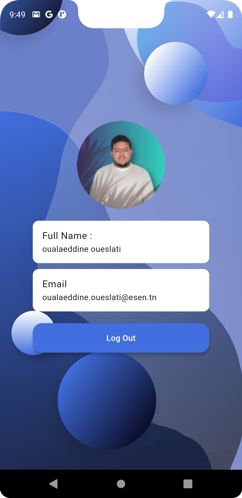

# AccountAuthSystem

## Project overview

This project is a Flutter-based authentication system utilizing Firebase for user management. It provides users with multiple sign-in options and a personalized experience based on the authentication method used.

## Features

- **Welcome Screen**: 
  - The starting point of the app, featuring two buttons at the bottom: 'Login' and 'Sign Up'.

- **Sign Up**:
  - Users can create an account by entering their full name, email, and password.
  - After successful registration, users are directed to the home page with a congratulatory message, displaying the email used to sign up.

- **Login**:
  - **Email and Password Login**: 
    - Users can log in using their registered email and password.
    - A "Forgot Your Password?" link is available for password recovery.
    - After logging in, users are directed to a home page with a welcome back message and their email.
  - **Google Sign-In**:
    - Users can log in using their Google account.
    - After logging in with Google, users are directed to a profile page displaying their profile picture, full name, and email from their Google account.
    - A logout button is available to return to the welcome page.

## Usage

1. **Welcome Screen**: 
   - Choose 'Sign Up' to create a new account or 'Login' to access your existing account.

2. **Sign Up**:
   - Fill in your full name, email, and password.
   - After registration, you'll be greeted with a congratulatory message on the home page.

3. **Login**:
   - **Email and Password**: Enter your credentials and proceed to the home page with a welcome back message.
   - **Google Sign-In**: Choose to sign in with your Google account, which will direct you to a profile page showing your Google profile information.

4. **Logout**:
   - If logged in with Google, use the logout button on the profile page to return to the welcome screen.

## Technologies Used

- **Flutter**: Framework for building the mobile app.
- **Firebase Authentication**: Manages user authentication.
- **Google Sign-In**: Integrates Google account sign-in into the app.

## Notes

- **Authentication Methods**: The app supports email/password authentication and Google Sign-In.
- **Google Sign-In**: Currently, only Google Sign-In is implemented. Facebook and LinkedIn sign-ins are not included in this project.

## Live Demo

Check out the live demo of the app in action: 

## Screenshots

| Welcome Screen                                   | Sign Up Screen                                | Email Signed Up Screen                                        | Login Screen                                 |
|:------------------------------------------------:|:----------------------------------------------:|:-------------------------------------------------------------:|:---------------------------------------------:|
|  |  |  |  |

| Password Recovery                                       | Email Logged In Screen                                           | Google Request                                   | Google Logged In Screen                                   |
|:-------------------------------------------------------:|:---------------------------------------------------------------:|:------------------------------------------------:|:-----------------------------------------------------------:|
|  |  |  |  |                    |
